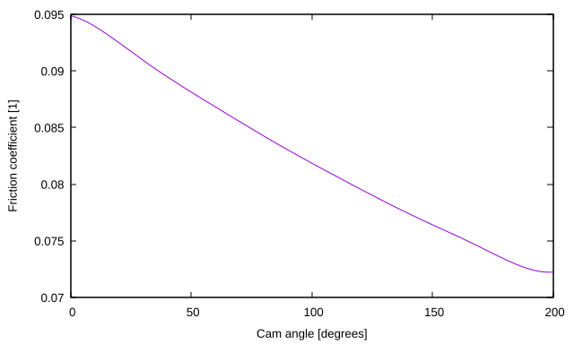

# Cam Shape Generator for Friction Locking Cams

This simple python script can be used to generate the shape of
friction locking cams used for clamping. The cam shape is generated
from the condition that it pushes against a planar surface. The cam
shape and rotation center are output as an SVG file. Optionally, the
script can output the xy-positions of the cam curve as well as the
friction coefficient required for the cam to lock as a function of the
cam angle.

Internally, the cam shape is represented as a cubic B-spline function
with an adjustable number of segments. The code can easily be adapted
to generate cam shapes for different constraints.

I wrote this little script to generate a cam for an adjustable tension
mechanism on a belt grinder I built and it has worked well for
me. I have not done any validation beyond that, so use this script at
your own risk.

# Example Usage

To generate a cam for a Luthier's clamp, for instance, the program can
be used in the following manner:

```
cam_solver.py -d 0.25 -r 0.75 -e 200 -f friction.txt luthier_cam.svg
```
This will generate the cam shape as shown below along with information
about the cam parameters.


The friction coefficient required for the cam to lock is written to
the file `friction.txt` and shown below.



The friction coefficient is in the range between 0.07-0.095 over the
entire angle range of the cam. The static friction coefficient for
wood on wood is typically in the range of 0.2-0.5, so this cam shape
should lock well.

The cam shape generated by the python script can be edited, e.g., in
`inkscape` and converted to a usable template for cutting out of
wood. To extend the cam curve into a handle, it is easiest to start
with vertical lines and rotate them by the start and end angles of the
cam in the counter-clockwise direction. The endpoints of those lines
can then be moved to the endpoints of the cam curve. This is
illustrated in the drawing below.


# Requirements

The script is written for python 3 and requires the numpy and svgwrite
modules.

# Bugs

The script only accepts input in inches.

# Usage

``` 
usage: cam_solver.py [-h] [--start-angle A_MIN] [--end-angle A_MAX]
                     [--displacement DISP] [--radius RAD] [--segments SEGMENTS]
                     [--samples SAMPLES] [--quadratic] [--pts PTS]
                     [--friction FRICTION]
                     output.svg

This program computes a cam shape for a given base radius, displacement and
range of rotation angles.

positional arguments:
  output.svg            Output file.

optional arguments:
  -h, --help            show this help message and exit
  --start-angle A_MIN, -s A_MIN
                        Start angle of the cam.
  --end-angle A_MAX, -e A_MAX
                        End angle of the cam.
  --displacement DISP, -d DISP
                        Displacement of the cam.
  --radius RAD, -r RAD  Base radius of the cam.
  --segments SEGMENTS   Number of B-spline segments
  --samples SAMPLES     Number of sample points per segment
  --quadratic, -q       Increase displacement as a quadratic function in cam
                        angle (experimental)
  --pts PTS, -p PTS     Save points to file.
  --friction FRICTION, -f FRICTION
                        Save friction coefficient required for cam to lock as a
                        function of angle.
```

